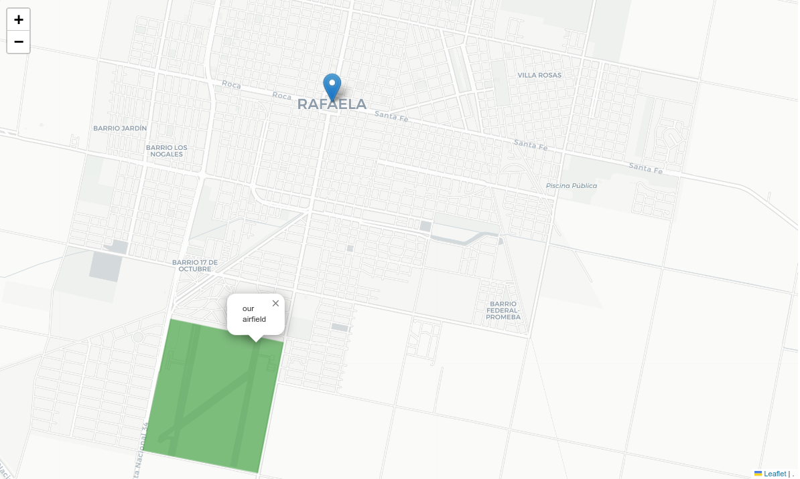
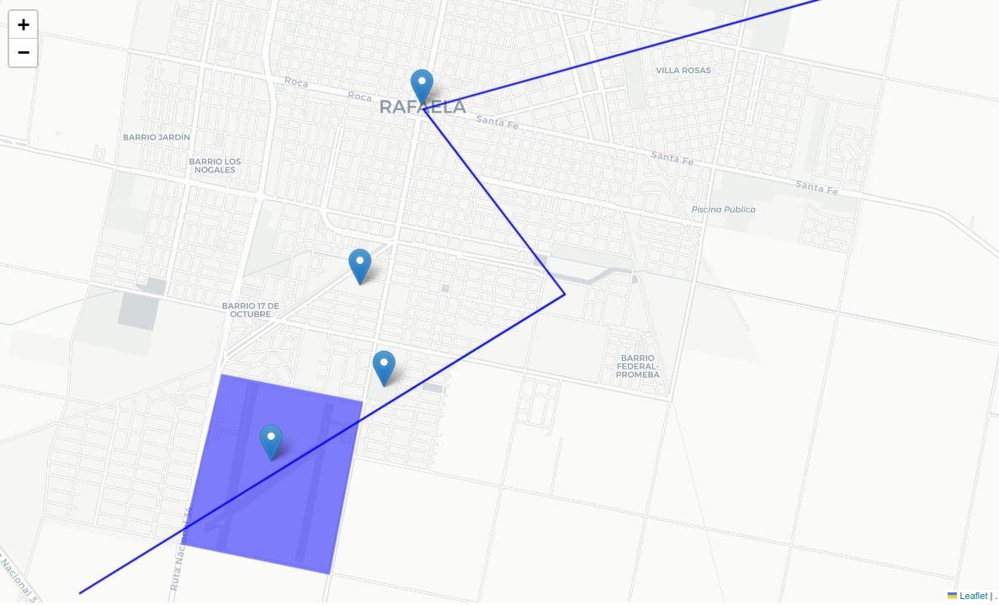

# Simplest Maps

Super simple on-liner maps in python.

# Installation

`pip3 install simplestmaps`

# Usage

This lib aims to be super simple to use. For instance, to draw a markers and an area, you could do something like this:

```python
from simplestmaps import draw_map, area, marker

draw_map(
    marker(-31.2526, -61.4917, popup="my hometown"),
    area([(-31.2741, -61.5105), (-31.2872, -61.5137), (-31.2895, -61.5003), (-31.2764, -61.4973)], color="green", popup="our airfield"),
)
```



It can even do more advanced stuff, like plotting the contents of a geojson file (points, areas, lines):

```python
from simplestmaps import draw_map, geojson

draw_map(
    geojson("./readme_example.geojson"),
)
```



SimplestMaps can plot markers, dots, labels (text), custom html, lines, areas and geojsons, and all of that can be combined in every map.

And every element plotted into the map is also customizable (colors, fonts, sizes, popups, etc).

# More demos and docs

Here are a good set of examples that showcase (and document) all of the supported features:

[Take a look at everything that's possible with so little code!](https://nbviewer.org/github/fisadev/simplestmaps/blob/f9ca71ff43f39ae201837a824d648d276bb1dd74/demo_and_docs.ipynb)
