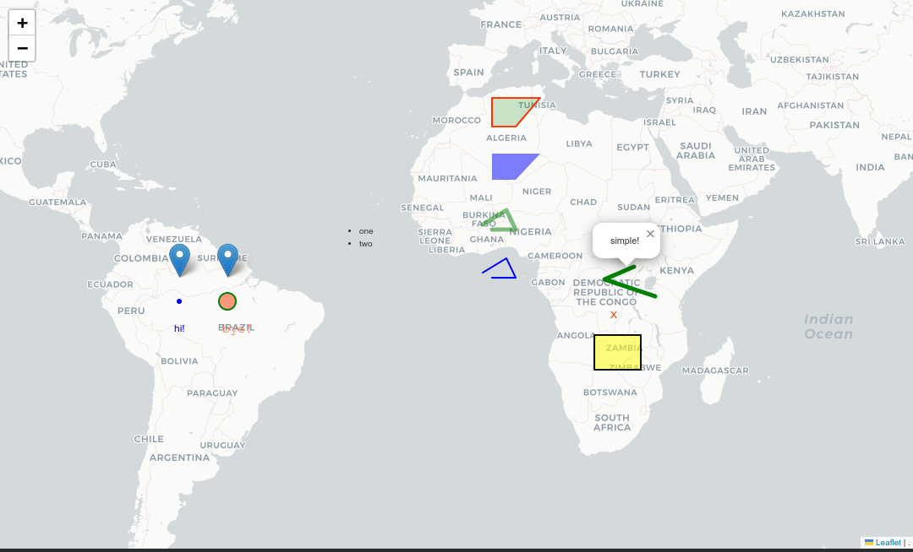

# Simplest Maps

Super simple on-liner maps in python. 

# Installation

`pip3 install simplestmaps`

# Usage

All of its current features at once, in a single example:

(I'll write better docs in the future :D)

```python
from simplestmaps import draw_map, dot, marker, label, html, line, area, geojson

draw_map(
    marker(0, -65),
    marker(0, -55, popup="hello world!"),

    dot(-5, -65),
    dot(-5, -55, popup="hello world!", color="red", radius=10, opacity=0.5, border_color="green", border_width=2),

    label(-10, -65, text="hi!"),
    label(-10, -55, text="bye!", font="courier new", size=15, color="red", opacity=0.75),

    html(10, -30, code="<ul><li>one</li><li>two</li></ul>", popup="custom html markers!"),

    line([(0, 0), (0, 5), (4, 3), (1, -2)]),
    line([(10, 0), (10, 5), (14, 3), (11, -2)], color="green", width=5, opacity=0.5, popup="hi!"),

    area([(20, 0), (20, 5), (25, 10), (25, 0)]),
    area([(30, 0), (30, 5), (35, 10), (35, 0)], color="green", opacity=0.2, border_color="red", border_width=2, popup="hi!"),

    #geojson("./demo.geojson"),

    geojson("./demo.geojson", 
            points_as=label(text="X", color="red"), 
            lines_as=line(color="green", width=5, popup="simple!"), 
            areas_as=area(color="yellow", border_color="black")), 
)```

Output:


